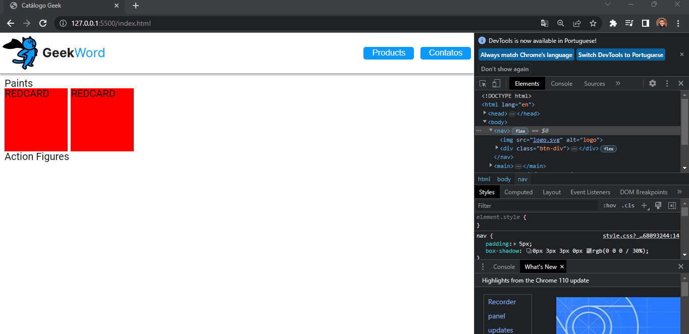

# S6-E1 Entrega: Catálogo Geek

## Introdução

Você foi convidado para ajudar alguns desenvolvedores a criar uma página Geek.
Inicialmente vocês usarão a página para listar os produtos que eles possuem em 
estoque e efetuarão as vendas por telefone ou aplicativos de venda.
Em suma, um catálogo virtual.

## nota:

fiz o JS um pouco diferente. pois não separei a lista netes de criar o card. a propria função que cria o card avalia seu destino.

configurando o deck de cartas:

com o JS implementado falta só arrumar as imagens

as imagens agora estão um pouco esticadas mas é por conta do formato delas não ser compatível com o estilo que foi solicitado.

